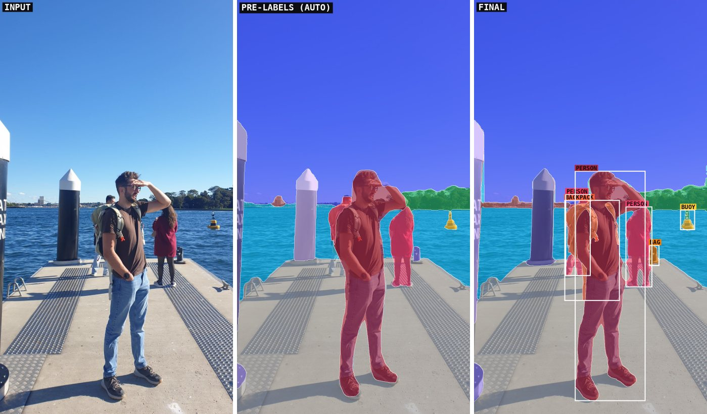
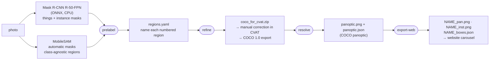

# panoptic-prelabel

**Semi-automatic panoptic annotation. Mask R-CNN pre-labels the countable objects ("things"), MobileSAM cuts the rest into class-agnostic regions that get named, a person corrects the result in CVAT, and a deterministic `resolve` step turns the overlapping corrected shapes into one COCO-panoptic map with instance boxes.**



*The `wharf` example. Left: the photo. Middle: the automatic pre-annotation, before any human correction. Right: the final map after correction in CVAT and `resolve`, with the instance boxes the website draws.*

**Highlights**
- **Deterministic `resolve`**: overlapping hand-drawn annotations become one COCO-panoptic map. Every priority rule has a synthetic test, including one that swaps the file order.
- **Metrics you can check**: `compare` matches the official panopticapi (PQ, SQ, RQ) to 1e-9, tested in CI, and every quality number of this pipeline below is regenerated by CI from committed files.
- **A model-zoo pitfall, found and fixed**: `MaskRCNN-12.onnx` silently clips boxes to 1279×959, so portrait photos lost everything below y = 960 (section 6).
- **Measured on a GPU**: on a Tesla T4, the Mask R-CNN network drops from 2.2 s on CPU to 107 ms with CUDA and 46 ms with TensorRT FP16, and MobileSAM's automatic mode from 169 s to 7 s. A single panoptic model, Mask2Former, is scored against the same corrected maps (section 5).

This produced the masks of the hero carousel on [juliendelclos.com](https://juliendelclos.com). The four scenes in `examples/` are the four scenes shown there. The quality numbers below come from `python scripts/evaluate.py`, which replays everything from committed files, no model needed. CI regenerates its output ([`docs/results.md`](docs/results.md)) and fails if it changes. The CPU timings were measured by hand. The GPU timings and the comparison with Mask2Former come from one run of [`benchmarks/`](benchmarks/README.md) on a Kaggle GPU, not regenerated by CI (section 5).

---

## 1. Pipeline



| Stage | Command | Input → output |
|---|---|---|
| prelabel | `panoptic-prelabel prelabel IMAGE --out WORK` | photo → `things.json` (detector instances), `regions.png` / `regions.jpg` (numbered regions), `regions.yaml` (template) |
| *naming* | edit `WORK/regions.yaml` | one class name (or `ignore`) per numbered region |
| refine | `panoptic-prelabel refine WORK` | → `coco_for_cvat.zip`, a clean pre-annotation to import into CVAT |
| *correction* | CVAT | import "COCO 1.0", fix, export "COCO 1.0" → `cvat_corrected.zip` |
| resolve | `panoptic-prelabel resolve cvat_corrected.zip --out DIR` | → `panoptic.png` + `panoptic.json` |
| export-web | `panoptic-prelabel export-web DIR/panoptic.json --image IMAGE --name NAME --out WEB` | → the overlays and boxes the website loads |
| evaluate | `panoptic-prelabel compare REF PRED [REF PRED ...]` | PQ (things / stuff), mIoU, pixel accuracy, pooled over image pairs |
| all of it | `panoptic-prelabel run SCENE_DIR --out OUT` | a scene directory, as in `examples/` |

Every sub-command accepts `--config my.yaml`. It overrides any subset of [`default.yaml`](src/panoptic_prelabel/configs/default.yaml). Unknown keys, wrong types (including inside lists), unknown class names and invalid values are all errors at load time.

### The two manual steps, as they are really done

1. **Naming the regions.** MobileSAM finds regions but does not say what they are. `prelabel` writes `regions.jpg`, the photo with every region colored and numbered, and a `regions.yaml` template. Someone looks at the picture and writes a class for each number. It can be a stuff class (`sky`, `sea`, …), a thing class the detector does not know (`bollard`, `buoy`), or `ignore`, which creates no annotation for the region: it stays a hole to draw in CVAT. Entries are matched by an interior point `(x, y)` rather than by number, so they survive a re-run. **In `examples/`, the regions were named by Claude (Anthropic's model) from `regions.jpg`, not by a person.** That was measured against the human correction (section 5).
2. **Correcting in CVAT.**
   - Import `coco_for_cvat.zip` into a CVAT task as *COCO 1.0*. The project labels are the 24 classes of the config; `panoptic-prelabel config` prints them with their colors.
   - Fix the polygons, draw what is missing, delete what is wrong.
   - Export the task again as *COCO 1.0*. That export is what `resolve` reads.

   The `examples/*/cvat_corrected.zip` are those exports, done by hand by the author of the photos. Only the image file name inside them was changed.

## 2. Why this design

**Why not a single panoptic model?** Every stuff class used here exists in COCO-panoptic, so Mask2Former or OneFormer would produce a panoptic map in one pass. The first version had to run with models available without a model hub (the ONNX model zoo and MobileSAM), which is where the detector + regions split comes from. Measured since on the four example photos, with Hugging Face's default 384 × 384 input, Mask2Former Swin-T does better on stuff, is level on the thing classes COCO has, and runs far faster on a GPU (section 5).

The split still has two properties a closed-vocabulary panoptic model lacks:
- the regions are class-agnostic, so classes outside COCO (bollard, buoy) come from naming, not from retraining;
- the region naming is a separate, inspectable step that can be done by a person or a model, and measured.

**Mask R-CNN for things.** Countable objects need one mask per instance. `MaskRCNN-12.onnx` runs with `onnxruntime` on CPU, and `things.coco_to_ontology` keeps only the COCO classes that match the ontology (person, backpack, handbag/suitcase → bag, bird, dog, cell phone → phone, car, truck/bus → truck, stop sign → sign).

**MobileSAM for stuff.** SAM's automatic mode segments everything, whatever its class. MobileSAM replaces SAM's ViT-H image encoder with a small TinyViT, which makes that mode usable on CPU (timings in section 5). It still needs PyTorch.

**Handling overlaps between things and stuff, before correction.** `prelabel` flattens the overlapping SAM masks into one partition:
- masks are painted from the largest to the smallest, so a rock inside the sea survives;
- a mask is dropped when more than half of it lies on a detected thing;
- regions below `stuff.min_region_area` are dropped.

`refine` then:
- merges named stuff regions per class;
- turns a region named with a thing class into an instance, or merges it into the detected instance of the same class it touches (a wrist watch SAM cut out of a person);
- cleans small holes and islands;
- gives the thin gaps between regions to the nearest stuff region, while ignored regions stay holes.

**Priority rules in `resolve`.** Corrected CVAT annotations overlap freely: a person polygon on top of the pavement polygon, a backpack on top of the person. `resolve` makes the result deterministic and independent of the order of the annotations in the file:

1. Things always win over stuff.
2. Between classes, the one listed first in `resolve.priority` wins. The order is bollard, sign, bird, buoy, phone, shoe, backpack, bag, dog, person, car, truck, then the stuff classes from fountain down to sky. Carried items sit in front of the person carrying them. Posts sit in front of the people standing behind them.
3. Within a class, the smaller annotation wins. An exact tie is broken by geometry (top-most, then left-most pixel), never by file order.
4. Classes in `resolve.split_classes` (`bag`) are split into connected components, because CVAT's COCO export merges every shape of one label drawn as one annotation. The reverse case, one object cut into several shapes by an occluder, is handled by an optional `scene.yaml` that groups annotation ids back into one instance (`examples/wharf/scene.yaml`: a backpack cut by an arm).
5. Stuff is one segment per class, following the COCO panoptic convention.
6. Pixels covered by no annotation go to the nearest segment (`resolve.fill: nearest`), so thin gaps between hand-drawn polygons do not show as holes.

Every rule has a synthetic test in `tests/test_resolve.py`, including one that swaps the file order.

## 3. Quickstart

```bash
git clone https://github.com/JujuDel/panoptic-prelabel && cd panoptic-prelabel
pip install torch torchvision --index-url https://download.pytorch.org/whl/cpu   # CPU-only PyTorch (see below)
pip install -e ".[models]"                                                         # Python ≥ 3.11
panoptic-prelabel download-weights && panoptic-prelabel run examples/wharf --out out/wharf
```

The first `pip install` keeps pip from installing the CUDA build of PyTorch, which on Linux pulls several GB of NVIDIA libraries this CPU pipeline does not use. It is PyTorch's documented CPU index, but this repository's own runs used the default PyPI build (`constraints.txt` lists the exact versions). `download-weights` fetches about 220 MB into `./weights` and checks the SHA-256 of each file.

`out/wharf/work/` holds the automatic pre-annotation, `out/wharf/panoptic/` the map resolved from the committed CVAT export, and `out/wharf/web/` the files the website uses.

For a new photo, put it alone in a folder and run the same command.
1. The run stops after `prelabel` and asks for `regions.yaml`. Fill in `OUT/work/regions.yaml` and copy it next to the photo.
2. Run again with `--skip-prelabel`: `refine` is re-run on the saved model outputs, so no inference is repeated.
3. Without a `cvat_corrected.zip` in the folder, the final map is resolved from the automatic pre-annotation.

**Without the models.** `pip install -e .` needs no model and no PyTorch; it is enough for `resolve`, `export-web` and `compare`, and `pip install -e ".[dev]"` adds what the tests need. `panoptic-prelabel run examples/wharf --out out/wharf --skip-prelabel` then runs the whole pipeline in a few seconds: it replays the model outputs recorded in `examples/wharf/prelabel/`.

## 4. Output format

**`panoptic.png` + `panoptic.json`: COCO panoptic, one image.**
- The PNG stores segment ids as `id = R + 256·G + 256²·B`, with 0 meaning void. With `fill: nearest` there is none.
- `segments_info` gives `id`, `category_id`, `area` and `bbox` (`[x, y, w, h]`, full resolution) for the *visible* part of every segment, after overlaps are resolved.
- `categories` carries `isthing` and the RGB `color`.
- Segment ids follow paint order: things first, front to back.

**`export-web`: what the website consumes.**

| File | Content |
|---|---|
| `NAME_raw.jpg` | the photo, upright. EXIF, GPS, XMP, maker notes, comments and any trailing embedded image are removed losslessly, and the ICC color profile is kept. A photo with an EXIF rotation is re-encoded upright instead |
| `NAME_pan.png` | RGBA overlay, long side 1024 px: every segment in its color (alpha 168), white boundaries (alpha 235) |
| `NAME_inst.png` | same size: things in their instance color (alpha 185), stuff dimmed to `#080a12` (alpha 150), a white outline around things |
| `NAME_boxes.json` | `{"name", "w", "h", "boxes": [{"cls", "color", "x", "y", "w", "h"}]}`, boxes in **percent** of the image |
| `NAME_scene.js` | the same data as an entry for the site's `SCENES` array |

The k-th instance of a class is drawn in its class color multiplied by `web.instance_shades[k]`. Bollards get no box because there are too many and they are too thin; neither do instances under `web.box_min_area` pixels.

Input photos are always used as displayed. The EXIF orientation is applied on load. When a photo has an EXIF rotation, `prelabel` writes the upright copy to upload to CVAT (`WORK/upright.jpg`), so the masks and CVAT see the same pixels.

## 5. Measurements

The reference is the human-corrected map: `resolve` run on `examples/*/cvat_corrected.zip`. That correction was made by one person, starting from the pre-labels of an earlier version, whose regions were also named by Claude. **These are agreement numbers on 4 photos, not accuracy against independent ground truth.** Metrics follow panopticapi: a segment matches at IoU > 0.5, statistics are pooled over the images, then averaged over classes. `compare` gives the same PQ, SQ and RQ as the official panopticapi to 1e-9, on these examples and on random maps with void and crowd regions (`tests/test_panopticapi_parity.py`, run in CI). The full per-class tables are in [`docs/results.md`](docs/results.md).

**How far the automatic pre-annotation is from the final map.** Today's pre-annotation, replayed from the recorded model outputs in `examples/*/prelabel/`, compared with the final corrected map. The correction itself was made on the July pre-labels, so this approximates the correction effort; it does not measure it:

| | PQ | PQ things | PQ stuff | mIoU | pixel accuracy |
|---|---|---|---|---|---|
| 4 photos, pooled | 45.0 | 36.1 | 54.8 | 55.7 | 90.17 % |

Nine pixels in ten of the pre-annotation have the class of the final map, but only 18 of its 34 thing instances are matched (and 18 of the 36 predicted ones are wrong or extra). Bollards, bags and trucks are missed or merged, and the detector folds the backpack into the person in `bay`. The CVAT step exists for those instances.

**How good the region naming was.** Each named region was compared with the class the correction gives most of its pixels. 129 of 187 regions (69 %) got the same class, covering 95.1 % of the named pixels. The errors are concentrated in small, ambiguous regions. The largest is vegetation on a cliff named `tree` where the correction says `rock` (8 regions, 63 k px). Next come `wall` where the correction says `pavement` (2 regions, 20 k px), then `tree` where it says `grass` (3 regions, 15 k px). Naming by a model is fast and right on the big regions, but the small ones still need a person.

**Agreement with the first version.** Re-resolving the same CVAT exports gives PQ 98.4 and 99.93 % pixel accuracy against the July 2026 version, which is what the website shows. The residual differences come from three things:
- one-pixel polygon rasterisation;
- gap filling;
- one `street` pavement segment, now merged into its class.

**Time.** Measured on a cloud sandbox: Intel Xeon @ 2.10 GHz, 2 vCPU, 7 GB RAM, Python 3.11, onnxruntime 1.25.0, torch 2.14.0 running on CPU.
- `panoptic-prelabel prelabel examples/street/image.jpg --out runs/street` reports `[prelabel] 177.5 s` for a 1204×1600 photo. Almost all of it is MobileSAM's automatic mode (32×32 point grid): Mask R-CNN alone takes 1.7 to 2.8 s.
- `panoptic-prelabel run examples/bay --out out/bay` took 162 s end to end, and two runs gave byte-identical regions.
- `resolve` takes about 1 s per photo.
- The time spent in CVAT was not measured.

**Against a single panoptic model.** `benchmarks/mask2former_baseline.py` scores Mask2Former (COCO-panoptic weights, Hugging Face post-processing with default thresholds) against the same human-corrected maps. "Common classes" leaves out bollard, buoy, shoe, fountain and boardwalk, which a COCO model cannot predict. Full tables: [`benchmarks/results/kaggle/mask2former_baseline.md`](benchmarks/results/kaggle/mask2former_baseline.md).

| predictor | PQ | PQ things | PQ stuff | mIoU | PQ, common classes | PQ things, common classes |
|---|---|---|---|---|---|---|
| this pipeline, automatic part | 45.0 | 36.1 | 54.8 | 55.7 | 46.8 | 36.8 |
| Mask2Former Swin-T | 49.4 | 30.7 | 68.0 | 52.6 | 54.8 | 38.4 |
| Mask2Former Swin-L | 45.5 | 22.1 | 71.2 | 52.3 | 50.3 | 27.1 |

- **Stuff.** Both Mask2Former models are clearly ahead (PQ stuff 68.0 and 71.2 against 54.8). This holds although the reference was corrected from the pre-labels of this pipeline's first version, which favours this pipeline.
- **Things.** On the classes COCO has, Swin-T is level with this pipeline (38.4 against 36.8). This pipeline's lead on all classes comes from the classes outside COCO, which only region naming provides.
- **Input size.** Both models ran with Hugging Face's default preprocessing, which resizes every photo to 384 × 384 (see COCO below). Small things (bags, distant people) suffer first, so the thing scores and the times above are for that size, not for the models at their usual resolution.
- **Swin-T against Swin-L.** Swin-L scores below Swin-T here, but above it on COCO (below). With 4 photos, one missed truck moves PQ things by about 6 points. These numbers support "a panoptic model does better on stuff"; they cannot rank the two Mask2Former models.

**Mask2Former on COCO.** On 100 COCO val2017 images (seed 0), scored by the official panopticapi: PQ 43.4 for Swin-T, 46.6 for Swin-L ([`coco_val.md`](benchmarks/results/kaggle/coco_val.md)). That is about 10 points below the 53.2 and 57.8 published for the full validation set with the original implementation. The likely main cause is the input size: Hugging Face's image processor for both checkpoints resizes every image to 384 × 384 (`size` in their `preprocessor_config.json`), where the original evaluation uses a short side of 800 px. The 100-image sample adds noise. Neither cause was measured apart. `compare` gives the same PQ as panopticapi on both runs, to 3e-16.

**On a GPU.** One run on Kaggle: Tesla T4, onnxruntime-gpu 1.25.0, TensorRT 10.16, torch 2.11 with CUDA 12.8 ([`latency.md`](benchmarks/results/kaggle/latency.md)). Median time of the Mask R-CNN network, and its detections compared with the CPU ones:

| backend | bay (736×1280) | wharf (960×544) | detections vs CPU |
|---|---|---|---|
| CPU (Xeon @ 2.0 GHz, 4 threads) | 2220 ms | 1666 ms | reference |
| CUDA | 107 ms | 81 ms | identical |
| TensorRT FP32 | 106 ms | 81 ms | identical |
| TensorRT FP16 | 46 ms | 41 ms | same 1 + 3 instances; mask IoU ≥ 0.83, score difference ≤ 0.04 |

- **TensorRT.** It does not take the whole graph. `RoiAlign` stays on CUDA, because its TensorRT plugin needs `libnvinfer_vc_plugin`, which the pip wheels do not ship. So do the casts to UINT8 and the nodes that read them, and one `NonMaxSuppression` that TensorRT's parser rejects. The model also needs onnxruntime's symbolic shape inference first. FP32 is therefore no faster than CUDA. FP16 about halves the time, but changes the masks slightly; with 4 detections in total, how much remains to be measured. CUDA takes 81 to 109 ms on all four photos.
- **MobileSAM.** Its automatic mode takes 169 s for `bay` on that CPU, and 6.6 to 7.9 s per photo on the T4, with regions identical to the recorded CPU ones. 256 prompts per batch instead of 64 does not help. It is the bottleneck: Mask2Former Swin-T takes 75 to 97 ms per photo on the same GPU, post-processing included.

## 6. Limits and next steps

**Limits.**
- Four photos and one annotator. The GPU numbers come from one run on one Kaggle T4, and there is no batching: the code handles one image at a time.
- The CVAT corrections in `examples/` were made from the July pre-labels of an earlier, unpublished version of this code, which this repository re-implements. The corrected exports are therefore not edits of today's `coco_for_cvat.zip`.
- Mask R-CNN outputs 28×28 masks, so boundaries are coarse. It knows only COCO's classes: bollard, buoy and shoe have no equivalent, and `sign` comes only from stop signs.
- `MaskRCNN-12.onnx` clips every box to x ≤ 1279, y ≤ 959, limits frozen in the exported graph and not documented in the model card. A portrait photo resized to the recommended short side of 800 px lost everything below y = 960, including a standing person's legs and most of their score. The input is therefore capped at 1280 × 960, so portrait photos run at lower resolution. See `things.py` and `tests/test_things.py`.
- CVAT polygons cannot hold holes. Masks with large holes are exported as RLE ("mask" shapes in CVAT).

**What I would do next, in order.** The Mask2Former baseline and the CPU / GPU latency table are done (section 5, code in [`benchmarks/`](benchmarks/README.md)).
1. **A panoptic model for the COCO classes.** On these photos, Mask2Former Swin-T is better on stuff, level on the COCO thing classes, and much faster on a GPU. The detector + regions split would then remain only for what COCO lacks (bollard, buoy, shoe). Check that first on more than four photos, and with Mask2Former at a short side of 800 px instead of 384 × 384.
2. **GPU and deployment path.**
   - If MobileSAM stays: run its image encoder once, then send batched prompts to the decoder in ONNX, seeded from the detector's boxes instead of a blind 32×32 grid. The grid is what costs 7 s per photo on a T4.
   - TensorRT FP16 for the detector, after measuring its mask differences on more detections than four. `RoiAlign` on TensorRT needs a TensorRT install that ships `libnvinfer_vc_plugin`.
3. **Measure annotation time** in CVAT against labelling from scratch. That is the metric a pre-annotation tool exists for.
4. **Automatic region naming** (CLIP-style, run on each region), scored with the same script as the model-written names above.

## 7. Engineering

- Python ≥ 3.11 package with a CLI entry point; `pip install -e .` needs no deep-learning framework.
- Config in YAML, validated when loaded.
- Tests. Every `resolve` rule has a synthetic case, and so do the config validation and the EXIF-rotation path. An opt-in test (`RUN_MODELS=1 pytest tests/test_models.py`, about 3 min on CPU) runs the real models and checks they still reproduce the recorded outputs in `examples/*/prelabel/`. `compare` is checked against hand-computed TP/FP/FN. The detector's pre/post-processing is tested with a fake ONNX session, so no weights are needed. The example scenes serve as regression cases.
- `ruff` and `mypy` run in CI.
- Model execution is configurable (`things.providers` for onnxruntime, `stuff.device` for PyTorch). Measured once on a Kaggle T4 (section 5).
- CI runs lint, types and tests on the exact versions in `constraints.txt`, and the tests again on the latest versions allowed by `pyproject.toml`. It builds and installs the wheel, runs the pipeline end to end on the recorded model outputs, and regenerates `docs/results.md`.

## 8. Licenses and credits

This repository is under the **Apache License 2.0** (`LICENSE`). It contains no third-party code or weights: `download-weights` fetches them from pinned upstream commits and checks their SHA-256. Details, with the files each license was read from, are in [`THIRD_PARTY_NOTICES.md`](THIRD_PARTY_NOTICES.md).

- **Mask R-CNN R-50-FPN**, `MaskRCNN-12.onnx`, from the [ONNX model zoo](https://github.com/onnx/models/tree/main/validated/vision/object_detection_segmentation/mask-rcnn). Model card: MIT. Converted from [facebookresearch/maskrcnn-benchmark](https://github.com/facebookresearch/maskrcnn-benchmark) (MIT). He et al., *Mask R-CNN*, ICCV 2017.
- **MobileSAM**, from [ChaoningZhang/MobileSAM](https://github.com/ChaoningZhang/MobileSAM) (Apache-2.0), at commit `f706ad9`. Zhang et al., *Faster Segment Anything: Towards Lightweight SAM for Mobile Applications*, 2023. Built on Meta's [Segment Anything](https://github.com/facebookresearch/segment-anything) (Apache-2.0) and Microsoft's TinyViT (MIT).
- **Libraries**: onnxruntime (MIT), PyTorch and torchvision (BSD-3-Clause), timm (Apache-2.0), OpenCV (Apache-2.0), NumPy and SciPy (BSD-3-Clause), Pillow (MIT-CMU), PyYAML (MIT). Annotation tool: [CVAT](https://github.com/cvat-ai/cvat) (MIT).
- **Photos**: the example photos (`examples/*/image.jpg`) are **not** covered by the Apache-2.0 license. All rights reserved; they are published only to demonstrate this pipeline.

## 9. Author

Julien Delclos, [juliendelclos.com](https://juliendelclos.com)

The code was written with [Claude Code](https://claude.com/claude-code), Anthropic's coding agent; the commits carry its co-author line. The photos and the CVAT corrections of the examples are mine.
